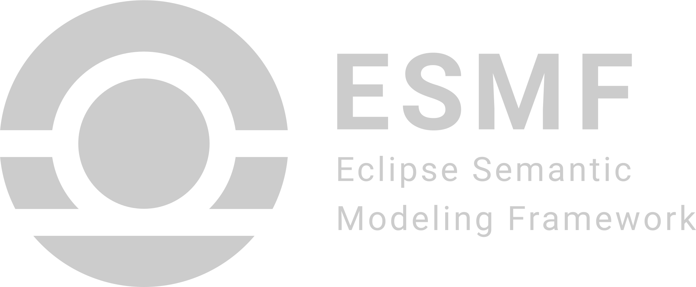
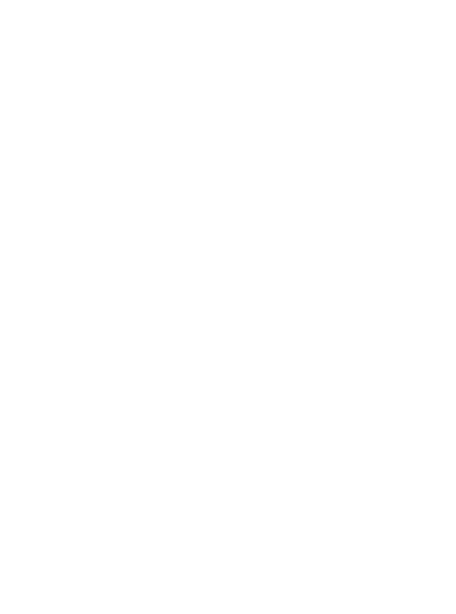

# ESMF Logo and Color Palette Guide

## Table of contents
  
1. [Foundational principles](#foundational-principles)
    1. [Icon parts](#icon-parts)
    2. [Color](#color)
    3. [Typography](#typography)
2. [Icon variants](#icon-variants)
3. [Logo with typography](#logo-with-typography)
   1. [Landscape](#landscape)
   2. [Portrait](#portrait)
4. [Favicon](#favicon)
5. [Downloads](#downloads)

## Foundational principles

### Icon parts

The ESMF icon consists of four independent parts. Each one stands for a different meaning, represented by a different color. These four elements represent the process steps during the usage of the ESMF framework with the orange Eclipse open source core in the center.

### Color

The following colors are used:

| Scope        | Color sample                                                    | Hex value | Description  |
|--------------|-----------------------------------------------------------------|-----------|----------|
| Consumption  |  | #995FAB   | Stands for *API consumption*, for example, the consumption of several Aspect-Model-based APIs in one application, thus providing a customer-friendly, semantics-aware software.|
| Provisioning |    | #8298E0   | Represents *API provisioning* and means the implementation phase where each Aspect Model is taken as a blueprint for building the corresponding API, making semantic information available in a modular way (also suitable for microservice-style software solutions).|
| Modeling    |  | #8DA5BF   | Symbolizes the *modeling phase* where the available raw data gets explained and described. As a result, these descriptions of data are turned into Aspect Models as a base for future data consumption via APIs.|
| Eclipse OSS  |          | #F88D2B   | Depicts the *underlying SAMM specification*, the "grammar" of how to construct Aspect Models. The Semantic Aspect Meta Model (SAMM) is located at the core of the logo. In the same way, the Eclipse open-source project is at the core of Aspect-Model-based APIs and software applications. That's why this core, SAMM, is colored in Eclipse orange. You might as well think of it as a sun shining light on your data by using semantics.

### Typography

The ESMF logo is a combination of the ESMF icon and the font "Roboto".

Download the font directly at: [Google fonts - Roboto](https://fonts.google.com/specimen/Roboto).

Roboto emphasizes on the strong connection between ESMF and the Eclipse Foundation, determining the open-source core of ESMF. 

Roboto is used in two different typefaces:

| Name                 | Typography sample                                            |
|----------------------|--------------------------------------------------------------|
| Roboto - Regular 400 |  |
| Roboto - Bold 700    |        |

## Icon variants

The icon and the logo are prepared for different applications and types of usage.

### Icon

| Name                                                            | Preferred usage                             | SVG                                              | PNG                                          |
|-----------------------------------------------------------------|---------------------------------------------|--------------------------------------------------|----------------------------------------------|
| ESMF Icon - color                                               | To be used on white and black surfaces      |  |  |
| ESMF Icon - white   | To be used on black and dark gray surfaces  |  |  |
| ESMF Icon - black                                               | To be used on white and light gray surfaces |  |  |
| ESMF Icon - gray                                                | To be used on white and black surfaces      |    |    |

## Logo with typography

The logo can be used in different surroundings and geometries. Therefore, two different versions are layouted to meet different geometrical needs.

### Landscape

| Name                                                            | Preferred usage                             | SVG                                                                            | PNG                                                                        |
|-----------------------------------------------------------------|---------------------------------------------|--------------------------------------------------------------------------------|----------------------------------------------------------------------------|
| ESMF Icon - color                                               | To be used on white and black surfaces      |  |  |
| ESMF Icon - white | To be used on black and dark gray surfaces  |  |  |
| ESMF Icon - black                                               | To be used on white and light gray surfaces |  |  |
| ESMF Icon - gray                                                | To be used on white and black surfaces      |    |    |

### Portrait

| Name                                                                     | Preferred usage                             | SVG                                                                          | PNG                                                                      |
|--------------------------------------------------------------------------|---------------------------------------------|------------------------------------------------------------------------------|--------------------------------------------------------------------------|
| ESMF logo portrait - color                                               | To be used on white and black surfaces      |  |  |
| ESMF logo portrait - white | To be used on black and dark gray surfaces  |  |  |
| ESMF logo portrait - black                                               | To be used on white and light gray surfaces |  |  |
| ESMF logo portrait - gray                                                | To be used on white and black surfaces      |    |   |

## Favicon
 

For implementing the favicon on any web resource, find the necessary files in the [favicon_package_v0.16](favicon_package_v0.16) folder (generated with [realfavicongenerator](https://realfavicongenerator.net/)).

The favicon files need to be transferred to the root folder of your web resource. 
Simply integrate the following HTML lines to the header of your page:

                <link rel="apple-touch-icon" sizes="180x180" href="{{{uiRootPath}}}/img/apple-touch-icon.png">
                <link rel="icon" type="image/png" sizes="32x32" href="{{{uiRootPath}}}/img/favicon-32x32.png">
                <link rel="icon" type="image/png" sizes="16x16" href="{{{uiRootPath}}}/img/favicon-16x16.png">
                <link rel="icon" type="image/x-icon" href="{{{uiRootPath}}}/img/favicon.ico">
                <link rel="manifest" href="{{{uiRootPath}}}/img/site.webmanifest">
                <link rel="mask-icon" href="{{{uiRootPath}}}/img/safari-pinned-tab.svg" color="#5bbad5">
                <meta name="msapplication-TileColor" content="#da532c">
                <meta name="theme-color" content="#ffffff">

## Downloads

Find all logo-related image files (PNG and SVG logo files, favicon image files) in the [2023_ESMF_Logo_V1.1](2023_ESMF_Logo_V1.1) folder.

